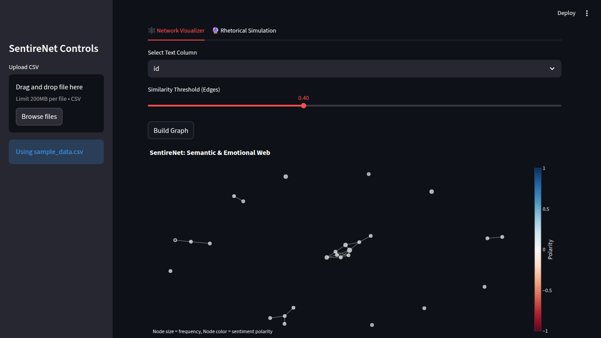

Project SentireNet: The Semantic & Emotional Web Analyzer
=========================================================

SentireNet is an interactive tool for visualizing the invisible web of ideas. It moves beyond simple keyword tracking to map the deep *semantic* and *emotional* connections within a body of text.

It's built on the idea that public discourse is a graph, where concepts are nodes and the edges are weighted by both semantic similarity (how related are two ideas?) and emotional resonance (how do they *feel*?).



Core Features
-------------

-   **Semantic Graph-Building:** Ingests any text corpus (CSV of tweets, product reviews, book chapters) and uses `sentence-transformers` to build a graph of key concepts based on their vector embeddings.

-   **Emotional Resonance:** Uses `textblob` to analyze the sentiment of each concept, adding an "emotional" dimension to the graph.

-   **Interactive 3D Visualization:** Renders the complex web of ideas as an interactive 3D or 2D graph using `plotly`. You can pan, zoom, and hover to see how concepts cluster and connect.

-   **Rhetorical Pathways Simulation:** The "what-if" engine. You can "drop" a new idea (a phrase or sentence) into the network and SentireNet will simulate its likely path, showing you which concepts it will activate, which emotional clusters it will energize, and its most likely "destination" in the network.

-   **Built with Streamlit:** A clean, fast, and beautiful web interface wraps the entire analysis.

Philosophy
----------

We don't just think in words; we think in connections. This tool is an attempt to map those connections. It can be used to:

-   **Analyze Brand Perception:** How do customers *really* feel about your product? What web of ideas does it live in?

-   **Understand Disinformation:** How do conspiracy theories or propaganda connect to legitimate anxieties? What "emotional bridges" do they use?

-   **Explore Literature:** Map the thematic and emotional web of a novel. How does "justice" connect to "vengeance" in *The Count of Monte Cristo*?

-   **Creative Brainstorming:** Find the "unseen" connections between ideas to spark new creative avenues.

How to Run
----------

1.  **Clone the repository:**

    ```
    git clone https://github.com/mohammadd13579/sentirenet.git
    cd sentirenet
    ```

2.  **Create a virtual environment (recommended):**

    ```
    python -m venv venv
    source venv/bin/activate  # On Windows: venv\Scripts\activate
    ```

3.  **Install the dependencies:**

    ```
    pip install -r requirements.txt
    ```

4.  **Run the Streamlit app:**

    ```
    streamlit run app.py
    ```

5.  Open your browser to the URL provided (usually `http://localhost:8501`) and start exploring.